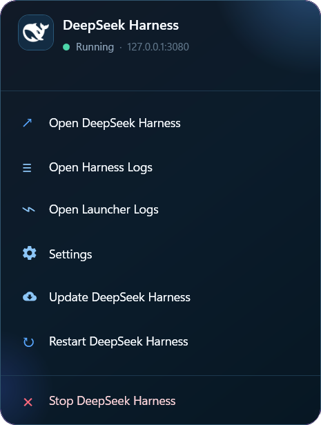

# DSH Launcher

<p align="left">
  <a href="https://github.com/SimonMedy/DSH-Launcher/releases"></a>
  <a href="LICENSE"></a>
  
  
</p>

An unofficial community Windows system tray launcher for DeepSeek Harness.

This project is not affiliated with or endorsed by DeepSeek.

It starts DeepSeek Harness silently in the background, opens the local web interface when ready, and provides a modern DeepSea WPF popup interface from the system tray with remote access configuration for [DSH-Mobile](https://github.com/SimonMedy/DSH-Mobile).

<p align="center">
  
</p>

---

## Features

- DeepSea dark ocean tray popup interface
- Instant local boot (`dsh web`) with silent background execution
- Automatic browser launch when web interface is ready
- System tray controls (open interface, view logs, settings, restart, stop)
- Built-in **Settings** UI to configure **Trusted Hosts** (Tailscale / LAN / DSH-Mobile)
- On-demand **Update DeepSeek Harness** feature with automated package management
- Automatic first-launch dependency installation
- Reliable process lifecycle management & port cleanup
- Single-instance protection

## Requirements

- Windows 10 or Windows 11 (x64)
- .NET 10 SDK (required for building via `setup.cmd`)
- Node.js installed (`npm` available in `PATH`)

DeepSeek Harness is launched natively with:

```text
dsh web
```

*(Installed automatically on first launch via `npm install -g @deepseek-ai/dsh@latest`)*

## Setup

1. Download or clone this repository.
2. Keep the folder in a permanent location.
3. Double-click `setup.cmd`.
4. The launcher builds automatically and creates a **DeepSeek Harness** shortcut on your desktop.

## Usage

Launch **DeepSeek Harness** from the desktop shortcut.

The launcher will:

1. Start DeepSeek Harness in the background (with any configured trusted hosts).
2. Wait for `http://127.0.0.1:3080`.
3. Open the interface in your default browser.
4. Keep the tray icon available while Harness is running.

### Tray Menu

Click the tray icon to open the DeepSea popup:

- **Open DeepSeek Harness** (opens `http://127.0.0.1:3080`)
- **Open Harness Logs**
- **Open Launcher Logs**
- **Settings** (configure remote hostnames & startup options)
- **Update DeepSeek Harness** (installs latest version on demand)
- **Restart DeepSeek Harness**
- **Stop DeepSeek Harness**

Double-clicking the tray icon also opens the web interface directly.

## Remote Access & DSH-Mobile Setup

If you use [DSH-Mobile](https://github.com/SimonMedy/DSH-Mobile) or access Harness over Tailscale / LAN:

1. Click the tray icon and select **Settings**.
2. Enter your Tailscale domain name or private IP addresses (one per line, or comma-separated):
   ```text
   my-pc.tailnet.ts.net
   100.x.y.z
   ```
3. Click **Save & Restart**.
4. The launcher will automatically start Harness with:
   ```text
   dsh web --trusted-host my-pc.tailnet.ts.net --trusted-host 100.x.y.z
   ```

Configuration is stored locally on your machine at:
`%LOCALAPPDATA%\DeepSeekHarness\config.json` (outside the Git repository).

## Logs

Logs are stored in:

```text
%LOCALAPPDATA%\DeepSeekHarness\logs\
```

Files:

```text
harness.log
harness-error.log
launcher.log
```

## Repository Structure

```text
.
├── README.md
├── LICENSE
├── setup.cmd
├── .gitignore
├── src/
│   └── DSHLauncher/
│       ├── App.xaml / App.xaml.cs
│       ├── MainWindow.xaml / MainWindow.xaml.cs
│       ├── SettingsWindow.xaml / SettingsWindow.xaml.cs
│       ├── DSHLauncher.csproj
│       └── Services/
│           ├── ConfigService.cs
│           └── HarnessService.cs
└── assets/
    ├── DeepSeekHarness.ico
    └── dsh-launcher-preview.png
```

- `setup.cmd` builds the WPF app to `dist/` and creates the desktop shortcut.
- `src/DSHLauncher` contains the modern WPF tray application code.
- `assets/` contains the application icon and visual assets.

## Notes

This project is only a Windows launcher for DeepSeek Harness. It does not bundle or modify DeepSeek Harness itself.

Stopping the launcher from the tray also terminates the DeepSeek Harness process tree it started.
